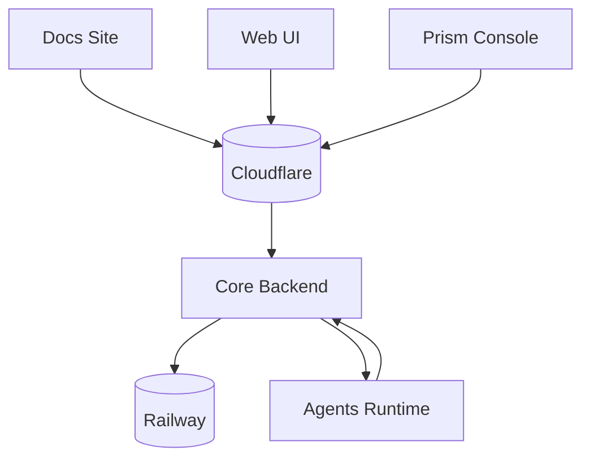

# BlackRoad OS Docs

This repository hosts the **BlackRoad OS Handbook**, the production-ready documentation hub for all BlackRoad surfaces (core backend, Web UI, Prism Console, agents, and infrastructure).

## What lives here
- Structured documentation powered by Docusaurus v3 with sidebar navigation.
- Opinionated style guide, glossary, and onboarding playbooks.
- Static health/version endpoints generated at build time (`/health.json`, `/version.json`).
- CI/CD and deployment workflow definitions for Railway or GitHub Pages.

## Getting started
1. Install Node 18+ and npm.
2. Install dependencies and run the local dev server:
   ```bash
   npm install
   npm start
   ```
3. Visit [http://localhost:3000](http://localhost:3000) to browse the docs.

## Deployment
- The docs build with `npm run build` (includes generating health/version metadata).
- Deploy to Railway using the provided `railway.json` or to GitHub Pages via the `deploy-docs` workflow.
- Branch mapping:
  - `dev` → preview/staging deployment
  - `staging` → staging environment
  - `main` → production

## Related repositories
- Core backend: https://github.com/blackroad-os/blackroad-os-core
- Web UI: https://github.com/blackroad-os/blackroad-os-web
- Prism Console: https://github.com/blackroad-os/blackroad-os-console
- Agents runtime: https://github.com/blackroad-os/blackroad-os-agents

## Infrastructure diagram


## Contributing
- Follow the style rules in [`docs/style-guide.md`](docs/style-guide.md).
- Keep environment tables in [`docs/infra/env-reference.md`](docs/infra/env-reference.md) aligned with the latest `.env.example` files across repos.
- Use `npx docusaurus docs:version <version>` when cutting a new release snapshot.
