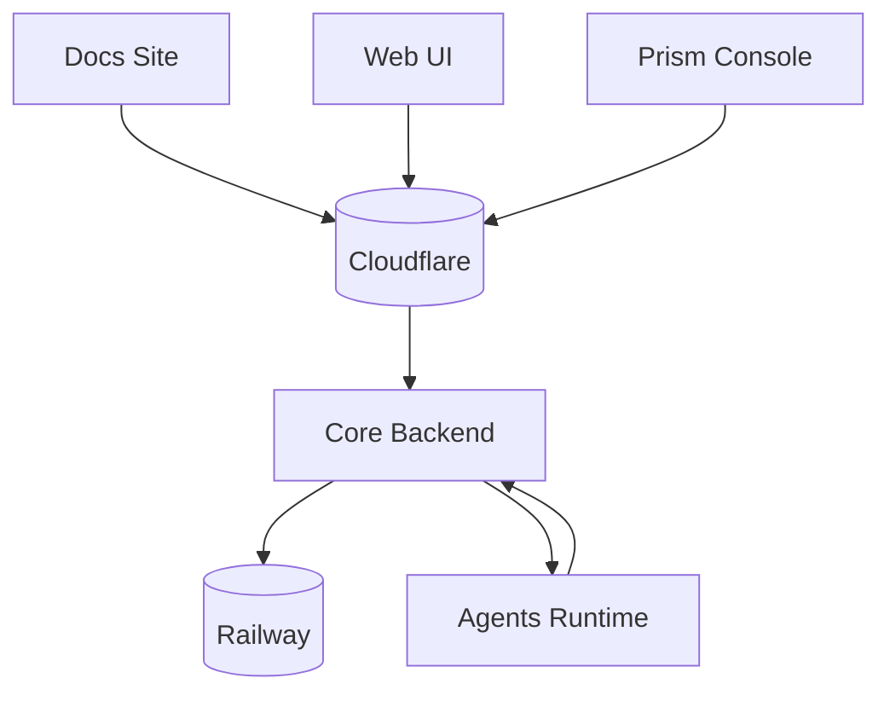

# BlackRoad OS Docs

This repository hosts the **BlackRoad OS Handbook**, the production-ready documentation hub for all BlackRoad surfaces (core backend, Web UI, Prism Console, agents, and infrastructure).

## What lives here
- Structured documentation powered by **Docusaurus v3** (content lives in `docs/`, navigation in `sidebars.js`).
- Opinionated style guide, glossary, and onboarding playbooks.
- Static health/version endpoints generated at build time (`/health.json`, `/version.json`).
- CI/CD and deployment workflow definitions for Railway.

## Getting started
1. Install Node 18+ and npm.
2. Install dependencies and run the local dev server:
   ```bash
   npm install
   npm start
   ```
3. Visit [http://localhost:3000](http://localhost:3000) to browse the docs.

## Documentation framework & structure
- **Framework:** Docusaurus v3 (static site). Routing is rooted at `/` (`routeBasePath: '/'` in `docusaurus.config.js`).
- **Docs location:** `docs/` organized into the following standard sections:
  - `intro/`
  - `core/`
  - `web/`
  - `console/`
  - `agents/`
  - `operator/` (stubbed until playbooks are written)
  - `infra/`
  - `onboarding/`
- **Navigation:** `sidebars.js` defines the tree for the `primarySidebar`. The navbar shows the unified "Docs" sidebar.

### Adding or updating pages
1. Add a Markdown file to the correct section in `docs/` (e.g., `docs/core/new-page.md`).
2. Register it in `sidebars.js` under the matching category so it appears in navigation.
3. Run `npm start` to verify local rendering.

### Health & hosting
- The site is static and exposes `static/health.json` and `static/health/index.json` at `/health` and `/health.json` for probes. A version payload lives at `/version` and `/version.json`.
- The production hostname is controlled through the `PUBLIC_DOCS_URL` env var (see below) and consumed via `src/config/docsConfig.js`.

### Deployment
- The docs build with `npm run build` (includes generating health/version metadata via `scripts/generateMeta.js`).
- Deploy to Railway using the provided `railway.json` and GitHub Actions workflow `.github/workflows/docs-deploy.yaml`.
- Branch mapping in the workflow:
  - `dev` → Railway environment `dev` (https://dev.docs.blackroad.systems)
  - `staging` → Railway environment `staging` (https://staging.docs.blackroad.systems)
  - `main` → Railway environment `prod` (https://docs.blackroad.systems)
  The workflow performs a smoke check against `/health` after deployment.

## Docs Deployment & Environments
This repository is the official BlackRoad OS documentation site. It deploys to the Railway project at
`https://railway.com/project/a4efb8cd-0d67-4b19-a7f3-b6dbcedf2079?environmentId=a41a126f-ecf9-47b1-8bd6-11ff9a02d799`
as the `docs-site` service.

Environment → URL mapping:
- **dev**: https://dev.docs.blackroad.systems (or local http://localhost:3000 via `npm run dev`)
- **staging**: https://staging.docs.blackroad.systems
- **prod**: https://docs.blackroad.systems

Required environment variables (loaded via `src/config/docsConfig.js`):
- `PUBLIC_DOCS_URL` (required outside of local dev, used for canonical links and metadata)
- `NODE_ENV`
- Optional cross-link targets: `CORE_API_URL`, `WEB_APP_URL`, `CONSOLE_URL`, `AGENTS_API_URL`

The `railway.json` file and `.github/workflows/docs-deploy.yaml` workflow keep build (`npm run build`) and start
(`npm run start`) commands aligned for deploys, with `/health` configured as the probe path.

## Related repositories
- Core backend: https://github.com/blackroad-os/blackroad-os-core
- Web UI: https://github.com/blackroad-os/blackroad-os-web
- Prism Console: https://github.com/blackroad-os/blackroad-os-console
- Agents runtime: https://github.com/blackroad-os/blackroad-os-agents

## Infrastructure diagram


## Contributing
- Follow the style rules in [`docs/style-guide.md`](docs/style-guide.md).
- Keep environment tables in [`docs/infra/env-reference.md`](docs/infra/env-reference.md) aligned with the latest `.env.example` files across repos.
- Use `npx docusaurus docs:version <version>` when cutting a new release snapshot.
