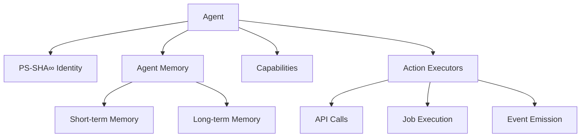

# Agent Ecosystem

The BlackRoad OS agent ecosystem is a distributed network of autonomous agents that can reason, act, and collaborate to accomplish complex tasks.

## Overview

BlackRoad OS agents are:
- **Autonomous:** Capable of independent decision-making
- **Identifiable:** Each has a unique PS-SHA∞ identity
- **Stateful:** Maintain memory and context across interactions
- **Collaborative:** Can work together on shared goals
- **Traceable:** All actions are auditable

## Agent Architecture



## Core Components

### Identity

Every agent has a PS-SHA∞ identity that:
- Uniquely identifies the agent
- Signs all agent actions
- Enables trust and verification
- Tracks agent lineage

See [Agent Identity and Memory](agents/agent-identity-and-memory.md) _(planned)_ for details.

### Memory

Agents maintain two types of memory:

**Short-term Memory:**
- Current conversation context
- Active task state
- Temporary variables

**Long-term Memory:**
- Historical interactions
- Learned patterns
- Persistent knowledge

### Capabilities

Agents declare what they can do:
- Code generation
- Documentation writing
- Data analysis
- System monitoring
- etc.

### Actions

Agents can:
- Call APIs
- Submit jobs to Operator
- Emit events
- Interact with other agents
- Modify their own state

## Agent Types

### Task Agents

Focused on specific, well-defined tasks:
- Code review agent
- Documentation agent
- Testing agent
- Deployment agent

### Orchestrator Agents

Coordinate multiple agents:
- Project manager agent
- Workflow agent
- Decision-making agent

### Monitor Agents

Observe and report:
- System health agent
- Performance monitoring agent
- Alert agent

### Research Agents

Explore and analyze:
- Data analysis agent
- Pattern recognition agent
- Optimization agent

## Agent Lifecycle

```
Created → Initialized → Active → Paused → Active → Deactivated
```

1. **Created:** Agent identity established
2. **Initialized:** Capabilities loaded, memory initialized
3. **Active:** Processing tasks and events
4. **Paused:** Temporarily inactive
5. **Deactivated:** Permanently stopped

## Agent Communication

Agents communicate through:

### Direct Messages
Point-to-point communication between agents.

### Events
Broadcast messages on event bus.

### Shared Memory
Collaborative access to shared data structures.

### Job Queue
Asynchronous task delegation via Operator.

## Agent Registry

The Agent Registry maintains:
- Active agent inventory
- Agent capabilities
- Agent status
- Agent relationships

## Best Practices

### Designing Agents

1. **Single Responsibility:** Each agent should have a clear, focused purpose
2. **Declarative Capabilities:** Explicitly declare what the agent can do
3. **Graceful Degradation:** Handle failures without cascading
4. **Observable:** Emit events for monitoring

### Agent Collaboration

1. **Clear Protocols:** Define communication patterns
2. **Event-Driven:** Use events for loose coupling
3. **Avoid Cycles:** Prevent infinite agent loops
4. **Timeout Handling:** Set reasonable timeouts

### Security

1. **Verify Identity:** Always check PS-SHA∞ signatures
2. **Least Privilege:** Grant minimal necessary permissions
3. **Audit Everything:** Log all agent actions
4. **Sandbox Execution:** Isolate untrusted code

## Development

### Creating an Agent

```typescript
import { Agent, AgentCapability } from '@blackroad-os/core';

const myAgent: Agent = {
  id: 'agent-unique-id',
  name: 'My Custom Agent',
  capabilities: [
    AgentCapability.CODE_GENERATION,
    AgentCapability.TESTING
  ],
  memory: {
    shortTerm: {},
    longTerm: {}
  }
};
```

See [Extending Agents](dev/extending-agents.md) for detailed guide.

### Testing Agents

```typescript
import { test, expect } from 'vitest';
import { createTestAgent } from '@blackroad-os/core/testing';

test('agent executes task', async () => {
  const agent = createTestAgent({
    capabilities: [AgentCapability.TESTING]
  });
  
  const result = await agent.execute(task);
  expect(result.status).toBe('success');
});
```

## Monitoring Agents

Use [Prism Console](ops/PRISM_CONSOLE.md) to monitor:
- Agent inventory and status
- Agent activity and performance
- Agent memory usage
- Agent communication patterns

## Related Documentation

- [Agents Atlas and Friends](dev/AGENTS_ATLAS_AND_FRIENDS.md) - Specific agent implementations
- [Extending Agents](dev/extending-agents.md) - Development guide
- [Core Primitives](dev/CORE_PRIMITIVES.md) - Agent data types
- [Events and RoadChain](dev/EVENTS_AND_ROADCHAIN.md) - Event system

## See Also

- [Service: Operator](services/service-operator.md) - Job execution
- [Service: API](services/service-api.md) - Agent API endpoints
