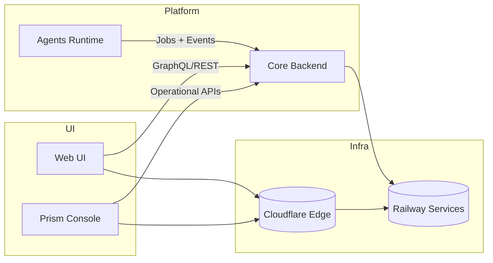

This overview maps the BlackRoad OS surfaces and how data flows between them.

### Ownership and repos
- Core backend: [`blackroad-os-core`](https://github.com/blackroad-os/blackroad-os-core)
- Web UI: [`blackroad-os-web`](https://github.com/blackroad-os/blackroad-os-web)
- Prism Console: [`blackroad-os-console`](https://github.com/blackroad-os/blackroad-os-console)
- Agents runtime: [`blackroad-os-agents`](https://github.com/blackroad-os/blackroad-os-agents)

> TODO: Enrich this section with infra subnet diagrams, data residency notes, and service discovery.
