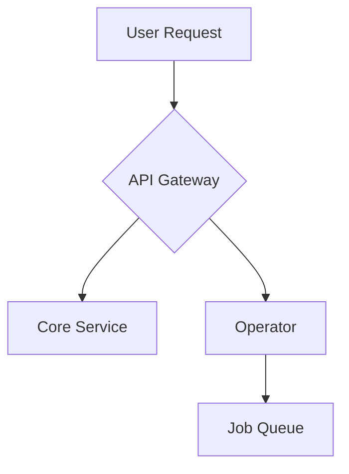

# ✍️ BlackRoad OS Docs Style Guide

This guide ensures consistency across all BlackRoad OS documentation, making it easier for both humans and agents to read, understand, and contribute.

---

## Document Structure

### Frontmatter

All Markdown files should include frontmatter with these fields:

```yaml
---
id: meta-style-guide              # kebab-case, unique within docs
title: "BlackRoad OS Style Guide" # Human-readable title
slug: /meta/style-guide           # URL path
description: "Style conventions for BlackRoad OS documentation" # Optional but recommended
tags: ["meta", "contributing"]    # Optional, for categorization
status: stable                    # Optional: stable, alpha, planned, deprecated
---
```

### Heading Hierarchy

Use headings in logical order:

```md
# H1 - Document Title (auto-generated from frontmatter title, use sparingly)
## H2 - Major Sections
### H3 - Subsections
#### H4 - Fine-grained details
```

**Rules:**
- Only one H1 per document (usually auto-generated from frontmatter)
- Don't skip heading levels (e.g., H2 → H4)
- Use sentence case for headings: "Getting started" not "Getting Started"

---

## Writing Style

### Tone

- **Clear and direct** - Get to the point quickly
- **Friendly but professional** - Use emojis sparingly and only where they add clarity
- **Assume intelligence** - Don't over-explain, but do provide context
- **Action-oriented** - Use active voice and imperative mood for instructions

### Examples

✅ **Good:**
```md
Configure the API endpoint by setting the `API_URL` environment variable.
```

❌ **Avoid:**
```md
The API endpoint can be configured by you if you set the environment variable that is called `API_URL`.
```

### Terminology

Use consistent terminology across all docs:

| **Preferred** | **Avoid** |
|--------------|-----------|
| BlackRoad OS | Blackroad, blackroad, BR |
| Prism Console | Prism, Console, Dashboard |
| Operator | Worker, Runner |
| Pack | Plugin, Extension, Module |
| Service | Microservice, App |

Refer to the [Glossary](./GLOSSARY.md) for canonical definitions.

---

## Formatting

### Code Blocks

Always specify the language for syntax highlighting:

````md
```typescript
const config = {
  apiUrl: process.env.API_URL
};
```
````

For shell commands, use `bash` or `sh`:

````md
```bash
npm install
npm run build
```
````

### Inline Code

Use backticks for:
- File names: `package.json`
- Environment variables: `API_URL`
- Code snippets: `const x = 42;`
- Commands: `npm install`

### Lists

**Unordered lists** for items without sequence:

```md
- First item
- Second item
- Third item
```

**Ordered lists** for sequential steps:

```md
1. Clone the repository
2. Install dependencies
3. Run the build
```

**Nested lists** should indent with 2 spaces:

```md
- Parent item
  - Child item
  - Another child
- Another parent
```

---

## Links

### Internal Links

Use **relative links** for internal documentation:

```md
See [Getting Started](guides/getting-started-local.md) for setup instructions.
```

For cross-references within the same directory:

```md
Refer to [Service API](./service-api.md) for details.
```

### External Links

Include descriptive text for external links:

✅ **Good:**
```md
Deploy using [Railway](https://railway.app)
```

❌ **Avoid:**
```md
Click [here](https://railway.app) to deploy
```

### Repository Links

Link to specific repos using full GitHub URLs:

```md
The API lives in [blackroad-os-api](https://github.com/BlackRoad-OS/blackroad-os-api)
```

---

## Diagrams

### Mermaid Diagrams

Prefer Mermaid for diagrams - they're text-based, versionable, and render nicely:

````md

````

### ASCII Diagrams

For simple diagrams, ASCII art works well:

```
┌──────────┐      ┌──────────┐
│   API    │─────▶│ Operator │
└──────────┘      └──────────┘
     │                  │
     ▼                  ▼
┌──────────┐      ┌──────────┐
│   Core   │      │  Packs   │
└──────────┘      └──────────┘
```

### No Binary Images

**Never commit binary images** (PNG, JPEG, etc.). Instead:
- Use Mermaid or ASCII diagrams
- Link to external, publicly accessible diagrams if absolutely necessary
- Use SVG sparingly (must be text-based SVG, not exported from design tools)

---

## Document Types

### Architecture Docs

**Purpose:** Explain system design and component relationships

**Structure:**
```md
## Overview
Brief introduction to the component or system.

## Components
Description of major parts and their responsibilities.

## Data Flow
How information moves through the system.

## Related Topics
- Links to relevant guides
- Links to API references
```

**Example:** `docs/overview/architecture-map.md`

---

### Service Docs

**Purpose:** Document individual services in the BlackRoad OS ecosystem

**Structure:**
```md
## What it does
High-level purpose and responsibilities.

## Repository
Link to GitHub repo.

## Key Features
- Feature 1
- Feature 2

## Deployment
How this service is deployed (link to infra docs).

## Health Checks
Expected endpoints: /health, /ready, /version

## Related Services
Links to other services this one interacts with.
```

**Example:** `docs/services/service-api.md`

---

### Runbooks

**Purpose:** Step-by-step operational procedures

**Structure:**
```md
## When to Use
Describe the scenario requiring this runbook.

## Prerequisites
Required access, tools, or knowledge.

## Steps
1. First action with expected outcome
2. Second action with verification step
3. Continue until complete

## Verification
How to confirm success.

## Rollback
What to do if something goes wrong.
```

**Example:** `docs/runbooks/deploy-api.md`

---

### How-To Guides

**Purpose:** Task-oriented tutorials for achieving specific goals

**Structure:**
```md
## Goal
What you'll accomplish.

## Prerequisites
- Required tools
- Required knowledge

## Steps
1. First step
2. Second step
3. Final step

## Verification
How to verify it worked.

## Next Steps
What to do next or related guides.
```

**Example:** `docs/guides/getting-started-local.md`

---

### Reference Docs

**Purpose:** Exhaustive technical details (API, CLI, configuration)

**Structure:**
```md
## Overview
Brief introduction.

## [Feature/Endpoint Name]
### Description
What it does.

### Parameters
| Name | Type | Required | Description |
|------|------|----------|-------------|
| param1 | string | yes | Description |

### Examples
Code examples showing usage.

### Error Codes
Common errors and solutions.
```

**Example:** `docs/reference/api-surface.md`

---

## Special Elements

### Callouts

Use blockquotes for important notes:

```md
> ⚠️ **Warning:** This will delete all data. Make sure you have backups.

> ℹ️ **Note:** This feature is experimental and may change.

> ✅ **Tip:** Use the `--dry-run` flag to preview changes.
```

### Tables

Use tables for structured data:

```md
| Service | Repository | Status |
|---------|------------|--------|
| API | blackroad-os-api | ✅ Active |
| Operator | blackroad-os-operator | ✅ Active |
| Web | blackroad-os-web | 🚧 In Development |
```

### Status Badges

Use consistent status indicators:

- ✅ Stable / Active
- 🚧 In Development / Alpha
- 📋 Planned
- ⚠️ Deprecated
- ❌ Removed

---

## File Naming

### Convention

Use kebab-case for all file names:

✅ **Good:**
- `getting-started-local.md`
- `service-api.md`
- `deploy-to-railway.md`

❌ **Avoid:**
- `Getting Started Local.md`
- `service_api.md`
- `DeployToRailway.md`

### Service Docs

Prefix service documentation with `service-`:
- `service-api.md`
- `service-operator.md`
- `service-core.md`

### Runbooks

Keep runbook names action-oriented:
- `deploy-api.md`
- `rollback-operator.md`
- `debug-prism-console.md`

---

## Version Control

### Commit Messages

Use clear, descriptive commit messages:

✅ **Good:**
```
Add runbook for API deployment
Update service-operator.md with health check info
Fix broken links in getting-started guide
```

❌ **Avoid:**
```
Update docs
Fix stuff
WIP
```

### Pull Requests

- Keep PRs focused on a single topic or change
- Link to related issues or discussions
- Update the sidebar if adding new pages
- Run `npm run build` before submitting

---

## Accessibility

- Use descriptive link text (not "click here")
- Provide alt text for any visual elements
- Ensure code examples can be copied easily
- Use proper heading hierarchy for screen readers

---

## Common Mistakes to Avoid

❌ **Don't:**
- Include secrets, tokens, or credentials
- Commit binary images or large files
- Use absolute URLs for internal links
- Write in first person ("I think", "We did")
- Use time-bound references ("Yesterday", "Last week")
- Duplicate content across multiple pages

✅ **Do:**
- Use environment variable names, not values
- Keep documentation DRY (Don't Repeat Yourself)
- Link to authoritative sources
- Write in present tense
- Update related pages when making changes
- Cross-reference related documentation

---

## Review Checklist

Before submitting documentation changes:

- [ ] Frontmatter is complete and correct
- [ ] Headings follow proper hierarchy
- [ ] Code blocks specify language
- [ ] Internal links are relative
- [ ] No secrets or sensitive data
- [ ] Spelling and grammar checked
- [ ] `npm run build` passes
- [ ] Sidebar updated if needed
- [ ] Related docs cross-linked

---

## Questions?

For questions or suggestions about this style guide:

- Open an issue in [blackroad-os-docs](https://github.com/BlackRoad-OS/blackroad-os-docs)
- Refer to [DOCS_CONTRIBUTING.md](meta/DOCS_CONTRIBUTING.md)
- Check the [Glossary](meta/GLOSSARY.md) for terminology
