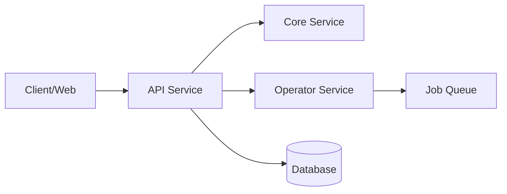

# Service: API

## What it does

The **BlackRoad OS API** is the primary HTTP gateway for the BlackRoad OS ecosystem. It provides RESTful endpoints for:

- Agent management and orchestration
- Job submission and monitoring
- Identity and authentication via PS-SHA∞
- Event streaming and subscriptions
- Integration with external systems

## Repository

- **GitHub:** [BlackRoad-OS/blackroad-os-api](https://github.com/BlackRoad-OS/blackroad-os-api)
- **Primary Language:** TypeScript (Node.js)
- **Framework:** Express / Fastify

## Key Features

- 🔐 PS-SHA∞ identity authentication
- 🤖 Agent lifecycle management
- 📊 Real-time event streaming
- 🔄 Job queue integration with Operator
- 📝 Comprehensive request/response logging
- ⚡ High-performance async operations

## Architecture



## Deployment

The API service is deployed using:

- **Platform:** Railway
- **Environment Variables:** See `.env.example` in the repository
- **Health Checks:** `/health`, `/ready`, `/version`

For deployment procedures, see:
- [Infra Guide](../ops/INFRA_GUIDE.md)
- [Deploy API Runbook](runbooks/deploy-api.md) _(planned)_

## Health Checks

Standard endpoints:

| Endpoint | Purpose | Expected Response |
|----------|---------|-------------------|
| `GET /health` | Basic health check | `200 OK` with `{ status: "healthy" }` |
| `GET /ready` | Readiness check (DB connected) | `200 OK` when ready |
| `GET /version` | Service version info | `200 OK` with version details |

## Key Endpoints

### Authentication
- `POST /auth/login` - User/agent authentication
- `POST /auth/refresh` - Token refresh
- `POST /auth/verify` - Verify PS-SHA∞ signature

### Agents
- `GET /agents` - List agents
- `POST /agents` - Create new agent
- `GET /agents/:id` - Get agent details
- `PATCH /agents/:id` - Update agent
- `DELETE /agents/:id` - Deactivate agent

### Jobs
- `GET /jobs` - List jobs
- `POST /jobs` - Submit new job
- `GET /jobs/:id` - Get job status
- `DELETE /jobs/:id` - Cancel job

For complete API reference, see [API Surface](reference/api-surface.md) _(planned)_.

## Related Services

- [Service: Core](./service-core.md) - Core domain logic and data models
- [Service: Operator](./service-operator.md) - Job orchestration and execution
- [Service: Prism Console](./service-prism-console.md) - Monitoring and observability UI
- [Service: Web](./service-web.md) - User-facing web application

## Environment Configuration

Key environment variables (see repository for complete list):

- `DATABASE_URL` - PostgreSQL connection string
- `REDIS_URL` - Redis connection for sessions/cache
- `API_PORT` - Port to listen on (default: 3000)
- `JWT_SECRET` - Secret for JWT signing
- `OPERATOR_URL` - URL of Operator service

> ⚠️ **Security:** Never commit actual values. Use Railway secrets or equivalent.

## Development

Local development setup:

```bash
# Clone the repository
git clone https://github.com/BlackRoad-OS/blackroad-os-api.git
cd blackroad-os-api

# Install dependencies
npm install

# Set up environment
cp .env.example .env
# Edit .env with local values

# Run in development mode
npm run dev
```

See [Local Development Guide](dev/local-development.md) for more details.

## Monitoring

- **Logs:** Available via Railway dashboard
- **Metrics:** Prometheus-compatible endpoints (if configured)
- **Tracing:** OpenTelemetry support (if configured)
- **Dashboard:** [Prism Console](../ops/PRISM_CONSOLE.md)

## Troubleshooting

Common issues:

### Service won't start
- Check environment variables are set correctly
- Verify database is accessible
- Check logs for connection errors

### Slow response times
- Check database query performance
- Review Redis cache hit rates
- Check Operator service health

### Authentication failures
- Verify JWT_SECRET is consistent across deployments
- Check token expiration settings
- Validate PS-SHA∞ signatures

For incident response, see [Incident Playbook](../ops/incidents-and-incident-response.md).

## Contributing

To contribute to the API service:

1. Review [Contributing Guide](../guides/contributing.md)
2. Follow [Coding Standards](../guides/coding-standards.md) _(planned)_
3. Submit PRs to the repository
4. Ensure all tests pass

## See Also

- [API Overview](dev/API_OVERVIEW.md) - High-level API concepts
- [Core Primitives](dev/CORE_PRIMITIVES.md) - Data models and types
- [Events and RoadChain](dev/EVENTS_AND_ROADCHAIN.md) - Event system
