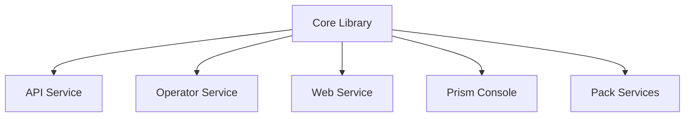

# Service: Core

## What it does

The **BlackRoad OS Core** is the foundational library and service containing:

- Shared domain models and types
- PS-SHA∞ identity primitives
- Agent data structures
- Common utilities and helpers
- Business logic abstractions

Core is used as a library by other services (API, Operator, Web) to ensure consistency across the ecosystem.

## Repository

- **GitHub:** [BlackRoad-OS/blackroad-os-core](https://github.com/BlackRoad-OS/blackroad-os-core)
- **Primary Language:** TypeScript
- **Type:** Shared library + optional standalone service

## Key Features

- 🧬 Type-safe domain models
- 🔐 PS-SHA∞ identity implementation
- 🤖 Agent primitives and interfaces
- 📦 Exportable as npm package
- ✅ Comprehensive test coverage

## Core Primitives

The Core service defines fundamental types used across BlackRoad OS:

### Agent Types
- `Agent` - Core agent definition
- `AgentIdentity` - PS-SHA∞ identity metadata
- `AgentMemory` - Agent memory and state

### Job Types
- `Job` - Job definition and metadata
- `JobStatus` - Job lifecycle states
- `JobResult` - Job execution results

### Event Types
- `Event` - Event definition
- `EventPayload` - Event data structures
- `EventSubscription` - Event subscription patterns

See [Core Primitives](dev/CORE_PRIMITIVES.md) for detailed documentation.

## Architecture



## Usage as Library

Other services import Core as a dependency:

```typescript
import { Agent, Job, Event } from '@blackroad-os/core';

const agent: Agent = {
  id: 'agent-123',
  name: 'Documentation Bot',
  capabilities: ['documentation', 'code-review']
};
```

## Deployment

Core can be deployed as:

1. **Library:** npm package imported by other services
2. **Service:** Standalone service for centralized logic (optional)

For most deployments, Core is used as a library only.

## Related Services

- [Service: API](./service-api.md) - Uses Core types for API contracts
- [Service: Operator](./service-operator.md) - Uses Core for job definitions
- [Service: Web](./service-web.md) - Uses Core for client-side types

## Development

Local development:

```bash
# Clone the repository
git clone https://github.com/BlackRoad-OS/blackroad-os-core.git
cd blackroad-os-core

# Install dependencies
npm install

# Run tests
npm test

# Build
npm run build
```

## Testing

Core has comprehensive test coverage:

```bash
# Run all tests
npm test

# Run tests in watch mode
npm run test:watch

# Generate coverage report
npm run test:coverage
```

## Contributing

Core is critical infrastructure. All changes require:

1. Comprehensive tests
2. Type safety
3. Backward compatibility
4. Documentation updates

See [Contributing Guide](../guides/contributing.md).

## See Also

- [Core Primitives](dev/CORE_PRIMITIVES.md) - Detailed type documentation
- [API Overview](dev/API_OVERVIEW.md) - How API uses Core types
- [PS-SHA∞ Architecture](../architecture/ps-sha-infinity.md) _(if exists)_
