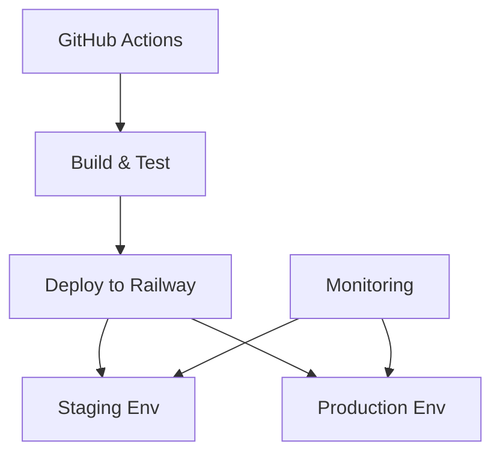

# Service: Infrastructure

## What it does

The **BlackRoad OS Infrastructure** repository contains:

- Infrastructure as Code (IaC) configurations
- Deployment pipelines and scripts
- Environment configurations
- Terraform/Pulumi definitions
- CI/CD workflows

This is where the operational backbone of BlackRoad OS is defined and managed.

## Repository

- **GitHub:** [BlackRoad-OS/blackroad-os-infra](https://github.com/BlackRoad-OS/blackroad-os-infra)
- **Tools:** Terraform, GitHub Actions, Railway configs
- **Languages:** HCL, YAML, TypeScript

## Key Components

### Deployment Configurations
- Railway service definitions
- Environment variable templates
- Database migration scripts
- Secret management patterns

### CI/CD Pipelines
- Automated testing workflows
- Deployment automation
- Rollback procedures
- Environment promotion

### Monitoring & Observability
- Logging configuration
- Metrics collection
- Alert definitions
- Dashboard templates

## Architecture



## Deployment Targets

### Railway
- **API Service:** `blackroad-os-api`
- **Operator Service:** `blackroad-os-operator`
- **Web Service:** `blackroad-os-web`
- **Prism Console:** `blackroad-os-prism-console`

### Cloudflare
- DNS management
- CDN configuration
- Edge routing

See [DNS and Networking](../infra/dns-and-networking.md) for details.

## Environment Management

### Staging
- Isolated testing environment
- Feature preview deployments
- Integration testing
- Performance validation

### Production
- High availability configuration
- Auto-scaling enabled
- Backup and disaster recovery
- Monitoring and alerting

See [Environments Guide](../infra/environments.md) for details.

## Development

Working with infrastructure code:

```bash
# Clone the repository
git clone https://github.com/BlackRoad-OS/blackroad-os-infra.git
cd blackroad-os-infra

# Install dependencies
npm install  # or terraform init

# Validate configurations
npm run validate  # or terraform validate

# Plan changes
npm run plan  # or terraform plan
```

## Deployment Procedures

For step-by-step deployment instructions, see:
- [Deployments and Runbooks](../infra/deployments-and-runbooks.md)
- [Deploy API Runbook](runbooks/deploy-api.md) _(planned)_
- [Deploy Operator Runbook](runbooks/deploy-operator.md) _(planned)_

## Security

### Secret Management
- Use Railway/Vercel environment variables
- Never commit secrets to git
- Rotate secrets regularly
- Use least-privilege access

### Access Control
- GitHub repository protection
- Railway team permissions
- Cloudflare API token scoping

## Monitoring

Infrastructure monitoring includes:
- Service health checks
- Resource utilization
- Deployment success rates
- Rollback frequency

## Related Documentation

- [Infra Guide](../ops/INFRA_GUIDE.md) - Operational guide
- [Environments](../infra/environments.md) - Environment details
- [DNS and Networking](../infra/dns-and-networking.md) - Network configuration

## Contributing

Infrastructure changes require:
1. Review by infrastructure team
2. Testing in staging environment
3. Validation of no downtime impact
4. Documentation updates

See [Contributing Guide](../guides/contributing.md).

## See Also

- [Stack Map](../overview/STACK_MAP.md) - Complete system overview
- [Incident Response](../ops/incidents-and-incident-response.md) - Incident handling
