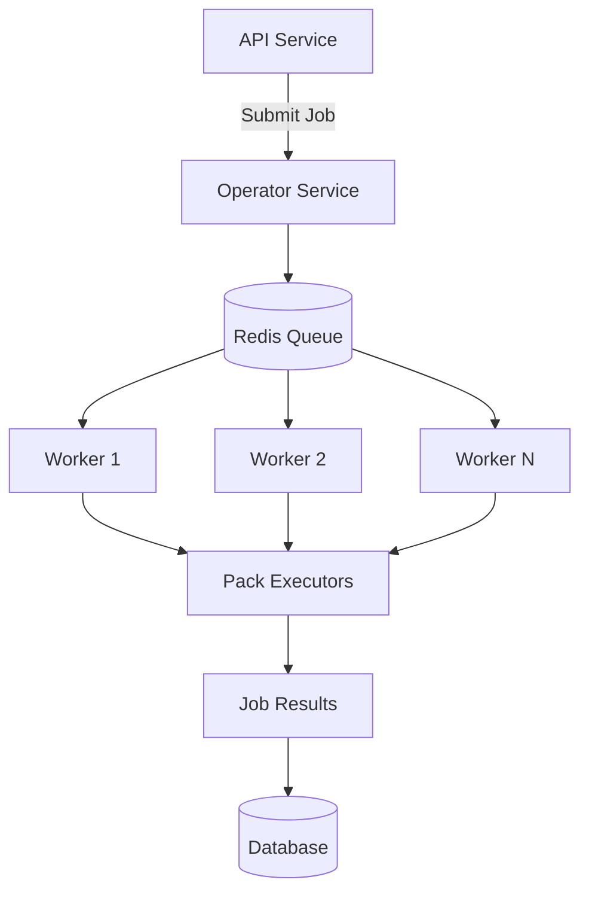

# Service: Operator

## What it does

The **BlackRoad OS Operator** is the job orchestration and execution engine. It manages:

- Asynchronous job processing
- Agent task execution
- Workflow orchestration
- Queue management
- Retry logic and error handling

The Operator is the backbone of BlackRoad OS automation, turning high-level requests from the API into executed work.

## Repository

- **GitHub:** [BlackRoad-OS/blackroad-os-operator](https://github.com/BlackRoad-OS/blackroad-os-operator)
- **Primary Language:** TypeScript (Node.js)
- **Queue System:** BullMQ / Redis

## Key Features

- 📋 Job queue management with BullMQ
- 🔄 Automatic retry with exponential backoff
- 🎯 Priority-based job scheduling
- 🔐 Secure job execution contexts
- 📊 Real-time job status updates
- 🧠 Agent memory and state management

## Architecture



## Deployment

The Operator service is deployed using:

- **Platform:** Railway
- **Scaling:** Horizontal scaling via worker processes
- **Environment Variables:** See `.env.example` in repository
- **Health Checks:** `/health`, `/ready`, `/queue-status`

For deployment procedures, see:
- [Operator Runtime Guide](../ops/OPERATOR_RUNTIME.md)
- [Deploy Operator Runbook](runbooks/deploy-operator.md) _(planned)_

## Health Checks

Standard endpoints:

| Endpoint | Purpose | Expected Response |
|----------|---------|-------------------|
| `GET /health` | Basic health check | `200 OK` |
| `GET /ready` | Readiness check (Redis connected) | `200 OK` when ready |
| `GET /queue-status` | Queue metrics | `200 OK` with queue stats |
| `GET /version` | Service version info | `200 OK` with version |

## Job Types

The Operator handles various job types:

### Agent Execution Jobs
Execute agent logic with specific contexts and memory.

### Workflow Jobs
Multi-step workflows with conditional logic and branching.

### Scheduled Jobs
Cron-style recurring tasks.

### Event-Triggered Jobs
Jobs triggered by system events or webhooks.

## Job Lifecycle

```
Pending → Active → Completed
   │        │          ↓
   │        └──→ Failed → Retrying
   │                  ↓
   └───────────→ Cancelled
```

1. **Pending:** Job is queued, waiting for worker
2. **Active:** Worker is processing the job
3. **Completed:** Job finished successfully
4. **Failed:** Job encountered an error
5. **Retrying:** Failed job is being retried
6. **Cancelled:** Job was manually cancelled

## Related Services

- [Service: API](./service-api.md) - Submits jobs to Operator
- [Service: Core](./service-core.md) _(planned)_ - Core business logic
- [Service: Prism Console](./service-prism-console.md) _(planned)_ - Job monitoring UI
- **Packs:** Various pack services that execute specific job types

## Environment Configuration

Key environment variables:

- `REDIS_URL` - Redis connection for queue
- `DATABASE_URL` - PostgreSQL for job metadata
- `WORKER_CONCURRENCY` - Number of concurrent jobs per worker
- `JOB_TIMEOUT_MS` - Default job timeout
- `MAX_RETRIES` - Maximum retry attempts
- `RETRY_BACKOFF_MS` - Initial retry delay

> ⚠️ **Security:** Never commit actual values. Use Railway secrets or equivalent.

## Development

Local development setup:

```bash
# Clone the repository
git clone https://github.com/BlackRoad-OS/blackroad-os-operator.git
cd blackroad-os-operator

# Install dependencies
npm install

# Set up environment
cp .env.example .env
# Edit .env with local values

# Start Redis (via Docker)
docker run -d -p 6379:6379 redis:latest

# Run in development mode
npm run dev
```

See [Local Development Guide](dev/local-development.md) for more details.

## Monitoring

- **Queue Dashboard:** BullBoard UI (if enabled)
- **Metrics:** Job completion rates, failure rates, latency
- **Logs:** Structured logging with context
- **Alerts:** Configure alerts for queue depth, failed jobs
- **Prism Console:** [Real-time monitoring](../ops/PRISM_CONSOLE.md)

## Performance Tuning

### Worker Concurrency
Adjust `WORKER_CONCURRENCY` based on:
- Available CPU/memory
- Job complexity
- External API rate limits

### Queue Priority
Set job priorities to ensure critical jobs execute first:
- **High:** User-facing operations
- **Normal:** Background tasks
- **Low:** Maintenance, cleanup jobs

### Memory Management
Monitor worker memory usage:
- Restart workers periodically if memory leaks detected
- Use separate queues for memory-intensive jobs

## Troubleshooting

Common issues:

### Jobs stuck in pending
- Check Redis connectivity
- Verify workers are running
- Review worker logs for errors

### High failure rates
- Check job timeout settings
- Review error logs for patterns
- Verify external service availability

### Queue growing indefinitely
- Increase worker count
- Reduce job creation rate
- Identify and fix failing jobs

For debugging procedures, see [Debug Operator Runbook](runbooks/debug-operator.md) _(planned)_.

## Contributing

To contribute to the Operator service:

1. Review [Contributing Guide](../guides/contributing.md)
2. Follow [Coding Standards](../guides/coding-standards.md) _(planned)_
3. Understand job lifecycle and queue patterns
4. Submit PRs with tests

## See Also

- [Operator Runtime](../ops/OPERATOR_RUNTIME.md) - Operational guide
- [Core Primitives](dev/CORE_PRIMITIVES.md) - Job data structures
- [Events and RoadChain](dev/EVENTS_AND_ROADCHAIN.md) - Event-driven architecture
- [Agents Atlas](dev/AGENTS_ATLAS_AND_FRIENDS.md) - Agent ecosystem
