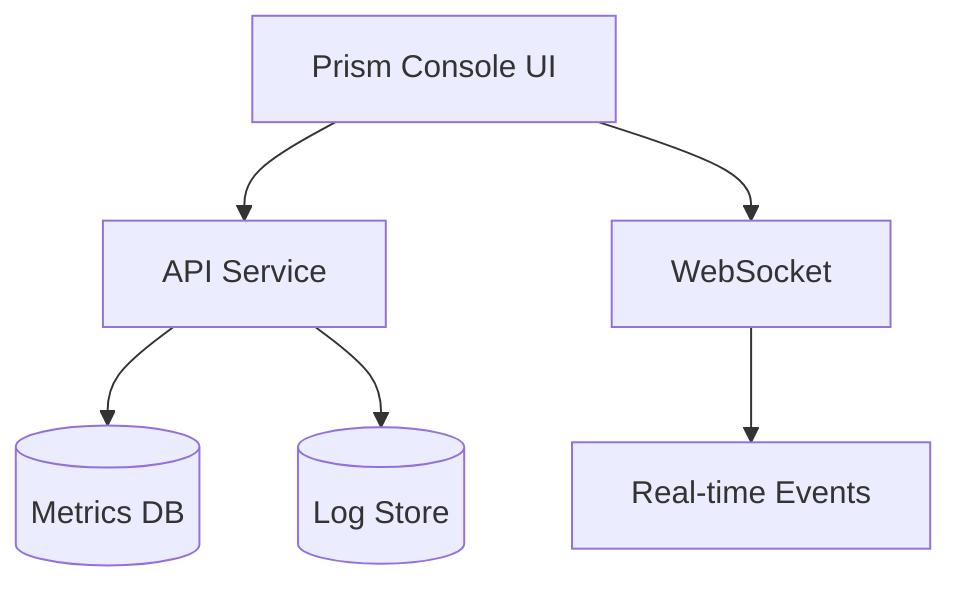

# Service: Prism Console

## What it does

The **Prism Console** is the operational command center for BlackRoad OS, providing:

- Real-time system monitoring
- Job and agent observability
- Performance metrics and dashboards
- Alert management
- System health visualization

Think of it as the "cockpit" for operating BlackRoad OS. 🛸

## Repository

- **GitHub:** [BlackRoad-OS/blackroad-os-prism-console](https://github.com/BlackRoad-OS/blackroad-os-prism-console)
- **Primary Language:** TypeScript (React)
- **Stack:** React + observability libraries

## Key Features

- 📊 Real-time metrics dashboards
- 🔍 Job and agent search/filtering
- 📈 Performance trending
- 🚨 Alert configuration and management
- 🗺️ System topology visualization
- 📝 Log aggregation and search

## Architecture



## Deployment

The Prism Console is deployed using:

- **Platform:** Vercel / Railway
- **Environment Variables:** See `.env.example` in repository
- **Access:** Protected by authentication

For deployment procedures, see:
- [Prism Console Guide](../ops/PRISM_CONSOLE.md)
- [Deploy Prism Runbook](runbooks/deploy-prism.md) _(planned)_

## Key Views

### System Overview
- Cluster health status
- Service availability
- Active agents count
- Job queue depth

### Agent View
- Agent inventory
- Agent status and health
- Agent memory usage
- Recent agent activity

### Job View
- Job queue monitoring
- Job success/failure rates
- Job execution timeline
- Failed job analysis

### Metrics View
- Custom dashboards
- Performance charts
- Resource utilization
- SLA tracking

## Environment Configuration

Key environment variables:

- `VITE_API_URL` or `NEXT_PUBLIC_API_URL` - API service URL
- `VITE_WS_URL` or `NEXT_PUBLIC_WS_URL` - WebSocket URL
- `AUTH_ENABLED` - Enable/disable authentication

> ⚠️ **Security:** Prism Console should always be protected in production.

## Development

Local development:

```bash
# Clone the repository
git clone https://github.com/BlackRoad-OS/blackroad-os-prism-console.git
cd blackroad-os-prism-console

# Install dependencies
npm install

# Set up environment
cp .env.example .env.local
# Edit .env.local

# Run development server
npm run dev
```

## Monitoring Best Practices

### Dashboard Setup
1. Configure key metrics for your use case
2. Set up alerts for critical thresholds
3. Create custom views for different teams

### Alert Configuration
- Job failure rate > 10%
- Queue depth > 1000 jobs
- Agent availability < 95%
- API response time > 2s

## Related Services

- [Service: API](./service-api.md) - Data source
- [Service: Operator](./service-operator.md) - Job monitoring
- [Service: Web](./service-web.md) _(planned)_ - User-facing application

## Troubleshooting

### Console not loading data
- Verify API service is running
- Check network connectivity
- Review browser console for errors

### Real-time updates not working
- Verify WebSocket connection
- Check firewall/proxy settings
- Review WebSocket server logs

## See Also

- [Prism Console Ops Guide](../ops/PRISM_CONSOLE.md) - Operational documentation
- [Operator Runtime](../ops/OPERATOR_RUNTIME.md) - Job monitoring context
