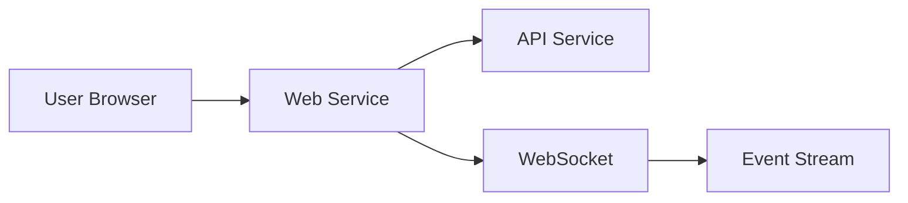

# Service: Web

## What it does

The **BlackRoad OS Web** is the user-facing web application providing:

- User interface for BlackRoad OS
- Agent management dashboard
- Job submission and monitoring
- Real-time updates and notifications
- Integration with API service

## Repository

- **GitHub:** [BlackRoad-OS/blackroad-os-web](https://github.com/BlackRoad-OS/blackroad-os-web)
- **Primary Language:** TypeScript (React/Next.js)
- **Framework:** Next.js with App Router

## Key Features

- ⚡ Server-side rendering with Next.js
- 🎨 Modern, responsive UI
- 🔄 Real-time updates via WebSockets
- 🔐 PS-SHA∞ authentication
- 📱 Mobile-friendly design

## Architecture



## Deployment

The Web service is deployed using:

- **Platform:** Vercel / Railway
- **CDN:** Cloudflare (for static assets)
- **Environment Variables:** See `.env.example` in repository

For deployment procedures, see:
- [Infra Guide](../ops/INFRA_GUIDE.md)
- [Deploy Web Runbook](runbooks/deploy-web.md) _(planned)_

## Key Routes

- `/` - Home page
- `/dashboard` - User dashboard
- `/agents` - Agent management
- `/jobs` - Job monitoring
- `/settings` - User settings

## Environment Configuration

Key environment variables:

- `NEXT_PUBLIC_API_URL` - API service URL
- `NEXT_PUBLIC_WS_URL` - WebSocket URL
- `AUTH_SECRET` - NextAuth secret
- `DATABASE_URL` - Database for sessions (if applicable)

> ⚠️ **Security:** Never commit actual values. Use Vercel/Railway secrets.

## Development

Local development:

```bash
# Clone the repository
git clone https://github.com/BlackRoad-OS/blackroad-os-web.git
cd blackroad-os-web

# Install dependencies
npm install

# Set up environment
cp .env.example .env.local
# Edit .env.local with local values

# Run development server
npm run dev
```

Visit http://localhost:3000

## Related Services

- [Service: API](./service-api.md) - Backend API
- [Service: Prism Console](./service-prism-console.md) - Operational dashboard

## See Also

- [Local Development](dev/local-development.md) - Development setup
- [Getting Started](../getting-started.md) - User guide
